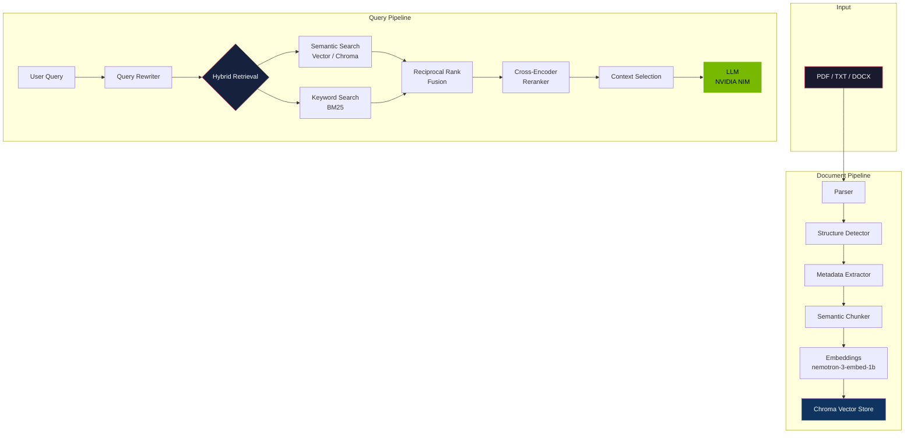
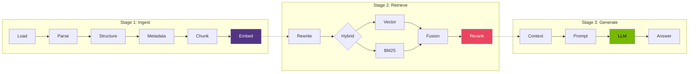
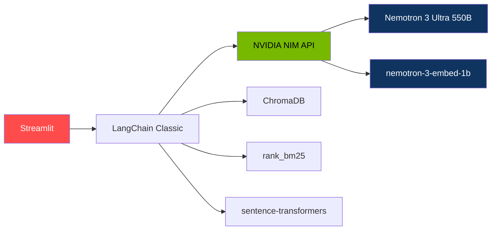

<p align="center">
  <h1 align="center">Smart Document Insights</h1>
  <p align="center">
    <em>Advanced RAG pipeline untuk analisis dokumen kompleks.</em>
  </p>
</p>

<p align="center">
  <a href="https://github.com/Maventlabs/smart-document-insights/blob/main/LICENSE">
    
  </a>
  <a href="https://github.com/Maventlabs/smart-document-insights/stargazers">
    
  </a>
  <a href="https://github.com/Maventlabs/smart-document-insights/network/members">
    
  </a>
  <a href="https://github.com/Maventlabs/smart-document-insights/issues">
    
  </a>
  <a href="https://github.com/Maventlabs/smart-document-insights/pulls">
    
  </a>
</p>

<p align="center">
  
  
  
  
  
  
</p>

<br>

---

<br>

## Arsitektur Sistem



<br>

## RAG Pipeline Detail



<br>

## Tech Stack



<br>

## Fitur

| Fitur | Deskripsi |
|-------|-----------|
| **Hybrid Retrieval** | Semantic (vector) + Keyword (BM25) dengan Reciprocal Rank Fusion |
| **Cross-Encoder Reranking** | Precisi ranking pakai `ms-marco-MiniLM` |
| **Query Rewriting** | Pronoun resolution + query expansion otomatis |
| **Document Parsing** | Structure-aware: detect headings, tables, sections |
| **Semantic Chunking** | Respect sentence/paragraph boundaries |
| **Multi-Format** | PDF, TXT, DOCX |
| **7 Model NIM** | Nemotron 3 Ultra, Lightning 3.5, Muse Glimmer, dll |
| **Export** | Chat, ringkasan, dan insights ke Markdown |

<br>

## Model yang Tersedia

| Model | Type | ID |
|-------|------|-----|
| Nemotron 3 Ultra 550B | Terkuat | `nvidia/nemotron-3-ultra-550b-a55b` |
| Nemotron 3.5 Lightning 30B | Seimbang | `nvidia/nemotron-3.5-lightning-30b-a3b` |
| Meta Muse Glimmer 30B | Kreatif | `meta/muse-glimmer-30b` |
| StepFun Step 3.7 Flash | Cepat | `stepfun-ai/step-3.7-flash` |
| Poolside Laguna XS 2.1 | Ringan | `poolside/laguna-xs-2.1` |
| Thinking Machines Inkling | — | `thinkingmachines/inkling` |
| **Embedding: Nemotron 3 Embed 1B** | RAG | `nvidia/nemotron-3-embed-1b` |

<br>

## Struktur Proyek

```
smart-document-insights/
├── app.py                         # Entry point
├── src/smart_doc/
│   ├── config.py                  # Konfigurasi
│   ├── core/
│   │   ├── document.py            # Document loading
│   │   ├── document_parser.py     # Enhanced parsing + metadata
│   │   ├── chunker.py             # Semantic chunking
│   │   ├── embeddings.py          # NVIDIA NIM embeddings
│   │   ├── rag.py                 # RAG chain + LLM
│   │   ├── retriever.py           # Hybrid: vector + BM25
│   │   ├── reranker.py            # Cross-encoder reranking
│   │   ├── query_rewriter.py      # Query expansion
│   │   ├── pipeline.py            # Full pipeline orchestrator
│   │   └── prompts.py             # System prompts
│   ├── ui/
│   │   ├── sidebar.py             # Sidebar config
│   │   ├── chat.py                # Chat tab
│   │   ├── summary.py             # Summary tab
│   │   ├── insights.py            # Key insights tab
│   │   └── stats.py               # Document stats
│   └── utils/
│       ├── file.py                # File helpers
│       └── export.py              # Export to Markdown
├── tests/                         # 20 unit tests
├── Dockerfile
├── pyproject.toml
└── requirements.txt
```

<br>

## Instalasi

```bash
git clone https://github.com/Maventlabs/smart-document-insights.git
cd smart-document-insights
python -m venv venv
source venv/bin/activate
pip install -r requirements.txt
```

<br>

## Menjalankan

```bash
streamlit run app.py
```

Buka `http://localhost:8501` lalu:

1. Masukkan **NVIDIA NIM API Key** (gratis di [build.nvidia.com](https://build.nvidia.com))
2. Upload dokumen (PDF/TXT/DOCX)
3. Pilih model → mulai tanya

<br>

## Deploy

### Streamlit Community Cloud (gratis)

1. Buka [share.streamlit.io](https://share.streamlit.io)
2. Login GitHub → New app → Pilih repo → Deploy

### Docker

```bash
docker build -t smart-doc-insights .
docker run -p 8501:8501 smart-doc-insights
```

<br>

## Testing

```bash
python -m unittest discover tests -v
```

<br>

## Catatan Keamanan

- API key tidak disimpan permanen
- Dokumen diproses di memori (in-memory)
- Semua model NIM gratis tanpa kartu kredit
- Rate limit: 40 requests/menit

<br>

---

<p align="center">
  <sub>Dibangun dengan NVIDIA NIM + LangChain + Streamlit</sub>
</p>
